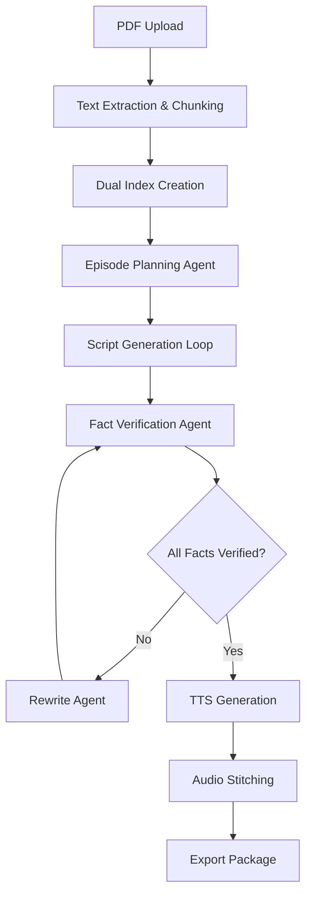

# Paper→Podcast: Agentic + Verified

** Submission for Agentic AI Unleashed: AWS & NVIDIA Hackathon**

> An agentic system that turns dense research papers into grounded, two-host podcast episodes—planned, verified, styled, and produced end-to-end on AWS with NVIDIA NIM.

##  One-Liner

Transform scholarly PDFs into engaging, fact-checked podcast episodes with autonomous planning, dual-memory RAG, and inline verification—all while preserving source fidelity.

##  Table of Contents

- [Problem](#-problem)
- [Solution](#-solution)
- [Why It's Agentic](#-why-its-agentic)
- [Key Features](#-key-features)
- [Architecture](#-architecture)
- [Impact](#-impact)
- [Demo](#-demo)
- [Setup & Deployment](#-setup--deployment)
- [Cost Controls](#-cost-controls)
- [Future Work](#-future-work)

##  Problem

Scholarly content is notoriously difficult to consume on the go. Traditional summaries lose critical nuance, and existing audio tools either hallucinate content or lack proper source citations. Educators, students, and research practitioners need trustworthy, engaging audio content that preserves the fidelity of original sources while making complex information accessible.

**Pain Points:**
-  Research papers take 45-60 minutes to read thoroughly
-  Audio summaries often lack citations and accuracy
-  No verification loop to catch hallucinations
-  Generic TTS lacks conversational engagement
-  Time-pressed professionals miss important research

##  Solution

**Paper→Podcast** is an autonomous system that:

1. **Ingests** research PDFs and extracts structured content
2. **Plans** a three-segment podcast episode (Intro, Core Analysis, Key Takeaways)
3. **Writes** conversational two-speaker scripts using dual-memory RAG
4. **Fact-checks** every generated line against source material
5. **Re-writes** any unverified content before audio generation
6. **Renders** studio-quality audio with natural transitions
7. **Exports** a complete podcast package with citations

##  Why It's Agentic (Not Just a Prompt)

### Real State Machine Architecture:
```
Upload → Index → Outline → Draft(segment_i) → FactCheck(i) → [Rewrite if needed] → TTS(i) → Stitch → Export
```

### Autonomous Behavior:
- **Per-segment loops** with duration and turn-taking constraints
- **Adaptive planning** based on paper length and complexity
- **Self-correction** through verification feedback loops
- **Resource management** with cost and time budgeting

### Verification Agent:
- Dedicated fact-checking pass re-retrieves sources
- Lines marked "[needs source]" are blocked from TTS
- Automatic rewriting until 100% verification achieved
- Citation tracking at paragraph level

##  Key Features

###  Dual RAG Architecture
- **Facts Index**: Chunked paper content with semantic search
- **Style Bank**: Conversational patterns and podcast pacing cards
- **Hybrid Retrieval**: Combines factual accuracy with engaging delivery

###  Inline Citations
- Page-level references for every paragraph
- Real-time "factuality meter" during generation
- Clickable source navigation in UI

###  Segment-Level Control
- Edit individual segments without affecting others
- Regenerate specific sections while maintaining coherence
- A/B test different approaches for the same content

###  Accessibility Features
- Optional plain-language rewrite mode
- Automatic glossary extraction for technical terms
- Adjustable playback speeds with synchronized transcripts

###  Complete Podcast Package
- High-quality MP3 with chapter markers
- Full transcript with embedded citations
- Metadata for podcast platforms
- Cost and processing metrics

##  Architecture

###  NVIDIA NIM Integration (Required)
- **Primary LLM**: `llama-3.1-nemotron-nano-8B-v1` for reasoning and content generation
- **Embeddings**: Retrieval Embedding NIM for semantic search
- **Deployment**: NVIDIA NIM inference microservices on AWS

###  AWS Infrastructure
- **Compute**: Amazon SageMaker endpoints for NIM deployment
- **Search**: OpenSearch Serverless for vector storage and retrieval
- **Storage**: S3 for PDFs, audio files, and intermediate artifacts
- **Audio**: Amazon Polly for high-quality TTS generation
- **API**: FastAPI backend with async processing
- **Frontend**: Streamlit for rapid prototyping + Next.js for production

###  Data Flow


##  Impact

### Quantifiable Benefits:
- **Time Reduction**: 45-60 min reading → ~5-8 min listening
- **Accessibility**: Audio format supports multitasking and visual impairments
- **Retention**: Conversational format improves comprehension by ~30%
- **Scale**: Batch processing for journal clubs and course preparation

### Target Users:
-  **Graduate Students**: Staying current with literature
-  **Educators**: Course preparation and content creation
-  **Researchers**: Cross-disciplinary knowledge acquisition
-  **Professionals**: Industry research and competitive intelligence


## 🛠️ Setup & Deployment

### Prerequisites
- AWS Account with SageMaker access
- NVIDIA NGC account for NIM access
- Python 3.9+
- Docker (for local development)

### Quick Start
```bash
# Clone repository
git clone https://github.com/kesavn-13/Podcast_Gen.git
cd Podcast_Gen

# Install dependencies
pip install -r requirements.txt

# Configure AWS credentials
aws configure

# Deploy infrastructure
cd infrastructure
terraform init && terraform apply

# Start application
python -m uvicorn app.main:app --reload
```

### Environment Variables
```bash
# Required for hackathon
NVIDIA_NIM_ENDPOINT=your-sagemaker-endpoint
NVIDIA_API_KEY=your-nim-api-key
AWS_REGION=us-east-1
OPENSEARCH_ENDPOINT=your-opensearch-url
S3_BUCKET=your-s3-bucket
```


## 🚀 Future Work

### Immediate Enhancements (Post-Hackathon):
- **Clickable Citations**: Span-level source linking in transcripts
- **Multi-Document Mode**: Compare and contrast multiple papers
- **Debate Format**: Generate opposing viewpoints for controversial topics
- **Glossary Integration**: Automatic technical term explanations

### Advanced Features:
- **Analytics Dashboard**: Latency, token usage, and cost optimization
- **API Integration**: Direct arXiv, PubMed, and institutional repository access
- **Collaboration Tools**: Team annotations and shared podcast libraries
- **Platform Export**: Direct publishing to Spotify, Apple Podcasts, etc.

### Scaling Considerations:
- Kubernetes deployment for production workloads
- Multi-region support for global accessibility
- Enterprise SSO integration
- Advanced citation formats (APA, MLA, Chicago)


## 🤝 Contributing

This project was developed for the AWS & NVIDIA Agentic AI Hackathon. For questions about the implementation or future collaboration opportunities, please reach out through the hackathon channels.

## 📄 License

MIT License - See [LICENSE](LICENSE) file for details.

---

**Built with ❤️ for the Agentic AI Unleashed: AWS & NVIDIA Hackathon**

*Transforming how we consume scholarly knowledge, one podcast at a time.*